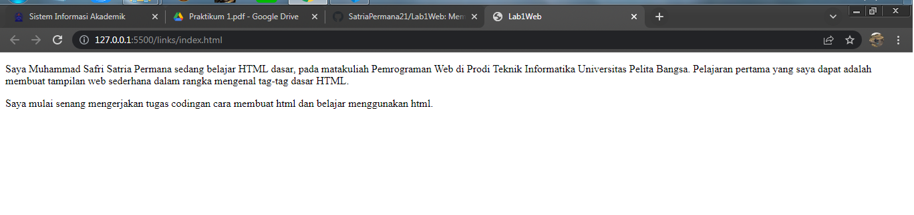
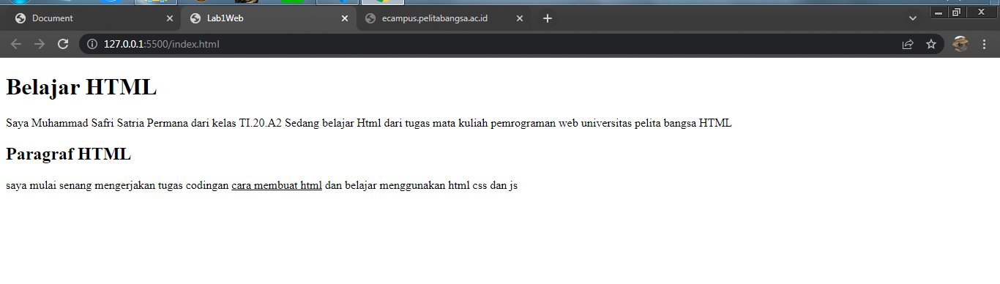
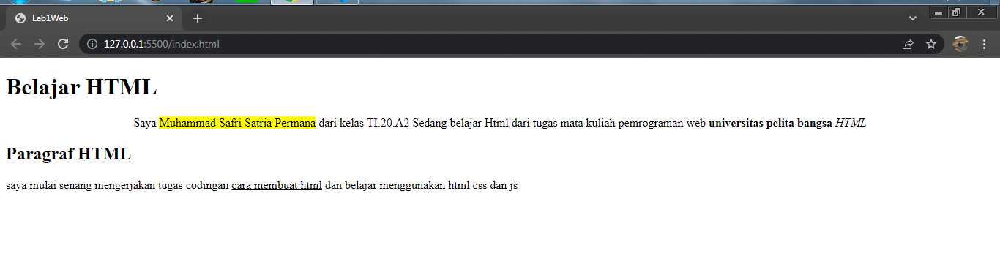
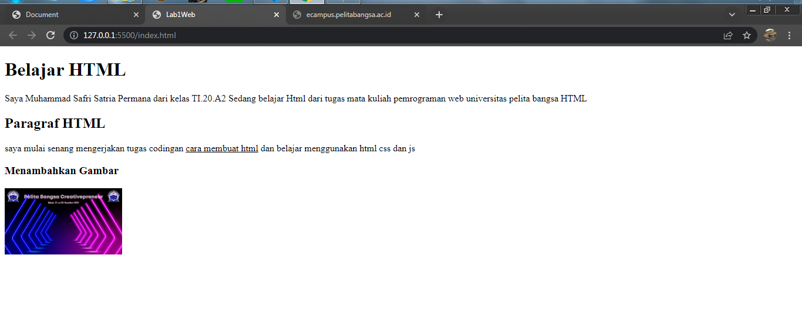
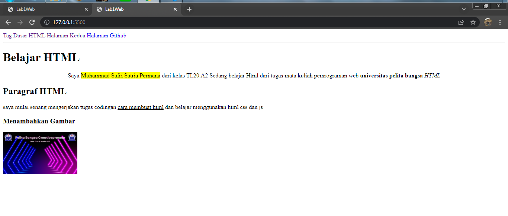

# LAB1WEB TUGAS PEMROGRAMAN
## PARAGRAF

Paragraf mempunyai tag/kode yaitu (p) kita dapat juga menambahkan atribut seperti warna, underline, dsb.

## HEADING

Heading merupakan judul artikel Heading terbesar yaitu (h1) dan seterus nya akan kecil (h2).

## FORMAT TEKS

ini adalah contoh dari atribut format teks,seperti memberi background, underline, bold, dsb.

## MENAMBAHKAN GAMBAR

untuk menambahkan gambar kita dapat menggunakan tag img kemudian lokasi direktori foto tsb.

## HYPERLINK

untuk menambahkan hyperlink kita menggunakan tag a herf.